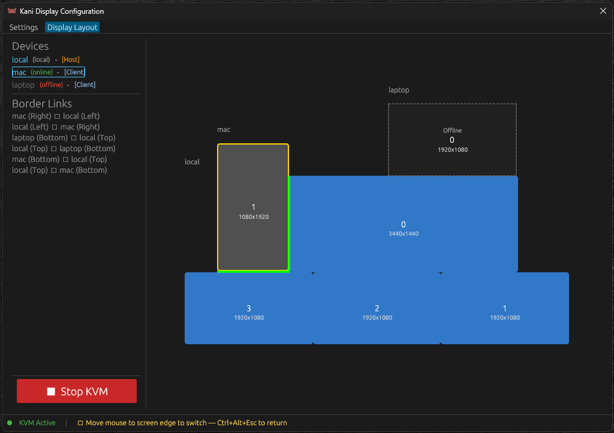
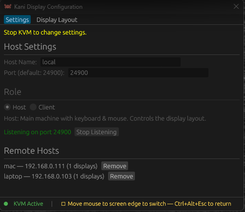

<p align="center">
  
</p>

<h1 align="center">Kani</h1>

<p align="center">
  <strong>キーボード、マウス、クリップボードを複数マシン間でシームレスに共有</strong>
</p>

<p align="center">
  <a href="https://www.rust-lang.org/"></a>
  <a href="LICENSE"></a>
  <a href="#"></a>
  <a href="#"></a>
</p>

<p align="center">
  <a href="README.md">English</a>
</p>

---

Kani は、LAN上の複数コンピュータを1組のキーボードとマウスで操作できる、無料・オープンソースのソフトウェアKVMです。Rust製、UDP による低遅延入力転送、DTLS暗号化通信。

---

## 特徴

- **クロスプラットフォーム** — macOS / Windows 両対応
- **低遅延** — UDP ベースの入力転送（TCP のヘッドオブラインブロッキングなし）
- **暗号化** — DTLS でネットワーク上の全入力を暗号化
- **クリップボード同期** — 1台でコピー、もう1台でペースト
- **ビジュアルレイアウトエディタ** — GUI でディスプレイ配置をドラッグ&ドロップ
- **システムトレイ** — バックグラウンド常駐、トレイに最小化
- **Host/Client モード** — 1台がホスト、他はクライアントとして自動接続
- **修飾キー変換** — macOS↔Windows 間で Ctrl↔Cmd を自動変換
- **緊急ホットキー** — Ctrl+Alt+Esc でいつでもカーソルをローカルに戻す

## 仕組み

マウスを画面端まで動かすと、カーソルが隣のマシンにシームレスに移動します。キーボード入力もカーソルに追従。クリップボードは自動同期されます。

```
  ┌──────────────┐         UDP/DTLS          ┌──────────────┐
  │    macOS     │◄─────────────────────────►│   Windows    │
  │  (Host)      │   keyboard + mouse + clip  │  (Client)    │
  └──────────────┘                            └──────────────┘
```

## スクリーンショット

<p align="center">
  
</p>

<p align="center">
  <em>ビジュアルディスプレイエディター — モニターをドラッグして物理的なデスク配置に合わせます。マシンごとに複数ディスプレイ対応。</em>
</p>

<br>

<p align="center">
  
</p>

<p align="center">
  <em>設定パネル — ホスト/クライアントのロール設定、リモートマシン管理、ワンクリックKVM起動。</em>
</p>

## なぜ Kani？

| | **Kani** | Synergy | Deskflow | Lan Mouse |
|---|---|---|---|---|
| **価格** | 無料 | $29〜 | 無料 | 無料 |
| **ライセンス** | MIT | 有料 | GPL | GPL |
| **言語** | Rust | C++ | C++ | Rust |
| **プロトコル** | UDP/DTLS | TCP/TLS | TCP/TLS | UDP/DTLS |
| **クリップボード同期** | あり | あり | あり | なし |
| **GUI設定** | あり | あり | あり | 最小限 |
| **macOS + Windows** | ファーストクラス | 対応 | 対応 | サブ対応 |
| **遅延** | 低い(UDP) | 高い(TCP) | 高い(TCP) | 低い(UDP) |

**Kani は良いとこ取り：** Lan Mouse 譲りの Rust + UDP の高速性に、Deskflow のようなクリップボード同期と充実した GUI を備え、商用利用に優しい MIT ライセンスで提供。

## インストール

### ビルド済みバイナリ

> 近日公開予定。現在はソースからビルドしてください。

### ソースからビルド

**必要環境:**
- Rust 1.78+ ([rustup.rs](https://rustup.rs/))
- macOS 12+ または Windows 10/11
- Windows: Visual Studio Build Tools (C++ ワークロード)

```bash
git clone https://github.com/Ramo-Inc/kani.git
cd kani
cargo build --workspace --release
```

## クイックスタート

### 1. 両方のマシンで GUI を起動

```bash
cargo run -p kani-gui --release
```

### 2. 設定

1. **Settings** タブで自分の **Host ID** を確認
2. リモートマシンを追加（Host ID、IPアドレス、解像度）
3. **Display Layout** でディスプレイをドラッグして配置
4. **Save Configuration** で保存
5. もう1台でも同じ手順を実施

### 3. 役割を選択

- **ホスト側**: Settings で "Host" を選択 → KVM サーバーが起動
- **クライアント側**: "Client" を選択、ホストの IP を入力 → 自動接続

### 4. KVM 開始

GUI で **Start KVM** をクリック。マウスを画面端に移動すると、カーソルがもう1台のマシンに移動します。

**緊急復帰:** **Ctrl+Alt+Esc** でいつでもカーソルをローカルに戻せます。

### ファイアウォール

両方のマシンで UDP ポート **24900** を許可:

```powershell
# Windows (管理者 PowerShell)
New-NetFirewallRule -DisplayName "Kani KVM" -Direction Inbound -Protocol UDP -LocalPort 24900 -Action Allow
```

macOS はデフォルトで着信 UDP を許可。ブロックされる場合:
```bash
sudo /usr/libexec/ApplicationFirewall/socketfilterfw --add /path/to/kani-gui
```

### macOS の権限設定

Kani は以下の2つの macOS プライバシー権限が必要です:

1. **入力監視** — システム設定 > プライバシーとセキュリティ > 入力監視
2. **アクセシビリティ** — システム設定 > プライバシーとセキュリティ > アクセシビリティ

ターミナルまたは `kani-gui` バイナリを両方に追加してください。

## 技術スタック

| レイヤー | 技術 |
|---------|------|
| 言語 | Rust |
| 非同期ランタイム | tokio |
| 入力プロトコル | UDP + bincode (512バイトパケット) |
| 暗号化 | DTLS (webrtc-dtls) |
| クリップボード転送 | TCP (長さプレフィクス付きメッセージ) |
| GUI | egui / eframe |
| システムトレイ | tray-icon / muda |
| macOS 入力 | CGEventTap |
| Windows 入力 | Raw Input API + SendInput |

## アーキテクチャ

```
kani/
├── crates/
│   ├── kani-proto/       # ワイヤプロトコル、設定、トポロジー、共有型
│   ├── kani-core/        # 仮想カーソル、エッジ検出、状態機械
│   ├── kani-platform/    # OS抽象化 (macOS CGEventTap / Windows Raw Input)
│   ├── kani-transport/   # UDP、DTLS、コネクション管理、TCPクリップボード
│   ├── kani-clipboard/   # クリップボード監視・同期
│   ├── kani-app/         # CLIバイナリ & KvmEngine
│   └── kani-gui/         # GUIとシステムトレイ (egui + tray-icon)
└── examples/             # 設定ファイル例
```

## ロードマップ

- [x] コア KVM（マウス + キーボード転送）
- [x] DTLS 暗号化
- [x] クリップボード同期（テキスト）
- [x] GUI ディスプレイレイアウトエディタ
- [x] Host/Client アーキテクチャ
- [x] システムトレイ（トレイに最小化）
- [x] 修飾キー変換（Ctrl↔Cmd）
- [ ] Auto-discovery（mDNS）
- [ ] 画像クリップボード同期
- [ ] ファイル転送
- [ ] Linux / Wayland 対応
- [ ] ビルド済みリリースバイナリ

## 開発

```bash
# ビルド
cargo build --workspace

# テスト
cargo test --workspace

# Lint（CI で強制）
cargo fmt --all -- --check
cargo clippy --workspace --all-targets -- -D warnings

# dry-run モード（プラットフォーム入力なし）
cargo run -p kani-app -- --config examples/kani-example.toml --dry-run
```

## コントリビュート

バグ報告、機能リクエスト、プルリクエスト、歓迎します！

```bash
# セットアップ
git clone https://github.com/Ramo-Inc/kani.git
cd kani
cargo build --workspace
cargo test --workspace
```

PR 提出前に `cargo fmt` と `cargo clippy` を実行してください。

## ライセンス

[MIT](LICENSE)

## 作者

**Ramo** — [@Ramo-Inc](https://github.com/Ramo-Inc)
